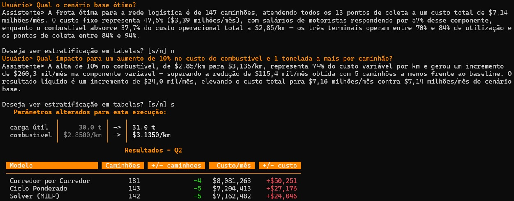
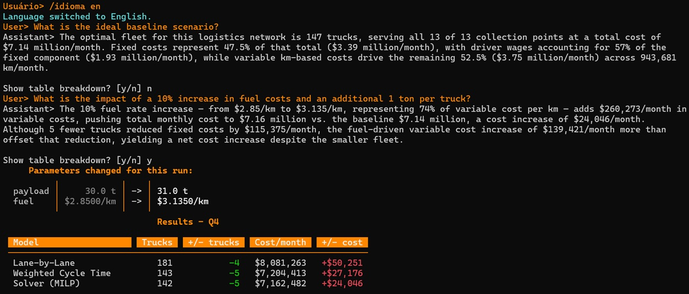

# Full Truck Load (FTL) Planning with LangGraph & LangChain Frameworks

A working example of what happens when you stop asking LLMs to do arithmetic and let them do what they are actually good at: understanding questions, structuring problems, and explaining results.

The math is handled by a MILP solver. The language is handled by agents. Neither does the other's job.

---

## The Core Idea

<p align="center">

</p>

A fleet planner asks:

```
If demand at terminal TA grows 20% and at TB drops 15%,
with optimal redistribution, how many trucks do we need?
```

The system does not guess. It:

1. **Classifies** the intent (what-if vs shock-response) 
2. **Parses** the question into structured solver parameters via the OR Agent
3. **Solves** a Mixed Integer Linear Program with Pyomo + HiGHS
4. **Explains** the result in two grounded sentences via the Transportation Expert

The LLM never touches a number it did not receive from the solver. The solver never sees natural language.

```text
User query
  → Intent Classifier (Haiku)
      │
      ├── what_if  → OR Agent (LangChain tool-calling)
      │              → ScenarioParams
      │              → MILP Solver (Pyomo / HiGHS)
      │              → Lane-by-Lane + Weighted Cycle Time models
      │              → Transportation Expert → 2-sentence grounded insight
      │
      └── shock_response → Shock Response Agent
                           → proposes 5 mitigation strategies
                           → Python solves and ranks by cost recovered
                           → LLM explanation from verified facts only
```

---

## Where LangGraph Comes In

Every workflow in this project is orchestrated with [LangGraph](https://github.com/langchain-ai/langgraph), a framework from LangChain for building controllable, stateful agent workflows in Python.

Three graphs handle the main flows:

- **Planning graph** — routes parsed `ScenarioParams` through the MILP solver, secondary models, and Transportation Expert. Each node operates on a typed `FleetPlanningState`; state does not leak across node boundaries.
- **Shock-response graph** — the Shock Response Agent calls the solver multiple times per query to test mitigation strategies, without external orchestration. LangGraph manages the tool-call loop.
- **Data Expert graph** — reads all `PipelineResult` entries from session history, pre-computes deltas and rankings in Python, then passes a `VERIFIED FACTS` block to the LLM. The LLM explains patterns it cannot recompute.

Three patterns from this project worth studying:

- **Stateless agent** — the OR Agent explicitly clears its message history before each call. Parameters from previous questions never carry over to the next query. Predictable by design.
- **Grounded expert** — the Transportation Expert has no tools and receives only computed outputs plus `Computed facts`, `Allowed explanations`, and `Forbidden explanations` blocks derived from the solver result. It cannot attribute a cost increase to a component that did not change.
- **Tools as the solver contract** — `run_milp_solver`, `compare_coverage_costs`, and `load_network_data_tool` are plain Python functions. The LLM calls them by name; Python executes them deterministically. No glue code needed.

---

## Why Three Models?

Every scenario produces a planning range, not a single number:

| Model | Role |
|---|---|
| Lane-by-Lane | Upper bound — dedicated trucks per CP-to-terminal lane |
| Weighted Cycle Time | Middle estimate — shared fleet via demand-weighted average cycle time |
| MILP Solver | Lower bound — Pyomo/HiGHS optimized fleet, cost, coverage, and redistribution |

This gives planners a defensible range to discuss, not a black-box answer to accept or reject.

---

## Example Questions

```text
What if truck speed drops 10 km/h and payload is 28 tonnes?
What if availability rises to 92% and fuel cost increases 8%?
What if we adopt 2 drivers per truck, increasing working days to 27?
What are the alternatives to compensate for a payload drop to 28 t per truck?
What does it cost to increase service coverage from 60% to 90% of collection points?
What is the best collection point coverage within a $4.85M monthly budget?
What is the minimum fleet to serve at least 80% of collection points?
What is the fleet and cost impact if terminal TB is closed?
If demand at TA grows 20% and at TB drops 15%, with optimal redistribution, how many trucks?
What is the impact of capping terminal TA's incoming volume to 80% of its historical capacity?
```

<p align="center">

</p>

<p align="center">

</p>

---

## Tech Stack

| Layer | Technology |
|---|---|
| Language | Python |
| Workflow / Orchestration | LangGraph |
| LLM agents | LangChain |
| LLM provider | Anthropic (Claude) or OpenAI |
| Terminal UI | Rich, prompt_toolkit opt-in |
| Optimization | Pyomo |
| Solver | HiGHS |
| Data | Pandas + Excel |
| Validation | Pydantic |

---

## Quick Start

```powershell
python -m venv venv
.\venv\Scripts\Activate.ps1
pip install -r requirements.txt
$env:ANTHROPIC_API_KEY="your-api-key"
python main.py
```

Inside the app:

```text
/language en
/onboarding
/baseline
/questions
```

Brazilian Portuguese is the default language. `/language en` switches to English.

---

## Project Layout

```text
.
├── main.py                    # Entry point
├── data/                      # Excel-backed network inputs
├── src/
│   ├── workflow/              # LangGraph graphs — planning, shock-response, data-expert
│   ├── llm_adapters/          # OR Agent, Expert, Data Expert, Shock Response Agent
│   ├── llm/                   # LangChain provider and model factory
│   ├── app/                   # CLI, command handlers, display, export, i18n
│   ├── domain/                # Data loading, dataclasses, capacity checks
│   └── models/                # Lane-by-Lane, Weighted Cycle Time, MILP solver

```

---

## Design Choices Worth Studying

**The OR Agent is stateless.** Each question is parsed independently. `run_or_agent` clears the message list before every call. No implicit session carry-over, no parameter bleed between queries, fully reproducible results from the same input.

**The Expert is grounded, not creative.** The Transportation Expert receives a `Computed facts` block alongside `Allowed` and `Forbidden` explanation lists generated from the solver output. If fuel did not change, the expert cannot mention fuel as a cause. If the fleet delta is negative, it cannot say the fleet improved. The facts constrain the language, not the other way around.

**Excel drives the network.** Changing the files in `data/` rewires the planning network — terminals, collection points, distances, demand, costs, lever limits — without touching agent prompts or solver code. The OR Agent builds its system prompt from live network data at startup.

**Shock response is deterministic after the LLM.** The Shock Response Agent proposes strategy candidates in natural language. Python validates each candidate, runs the MILP solver, and ranks results by recovered cost. The LLM never self-reports solver values; it only proposes what to test. All numbers in the output come from the solver.

---


